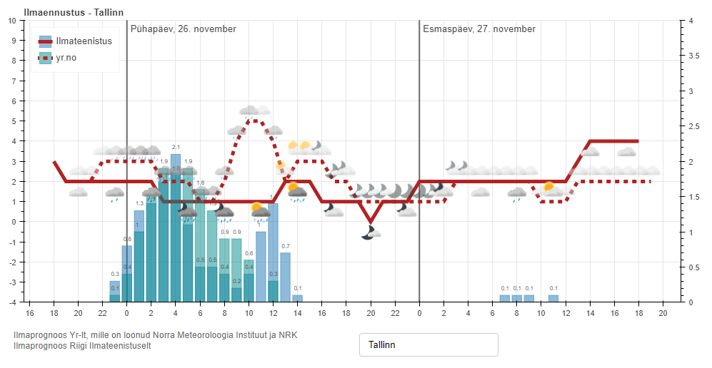
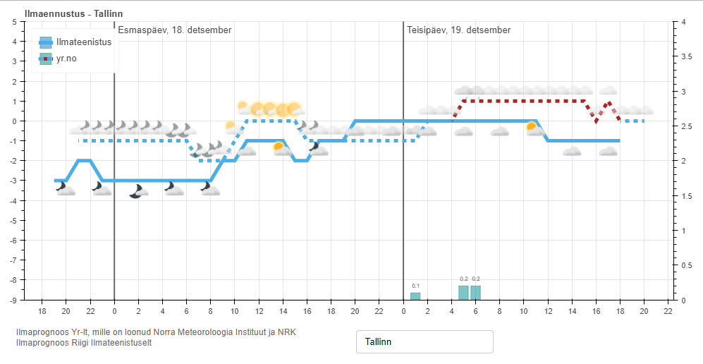
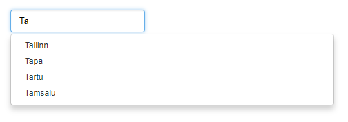

## Ilmaennustus
Rakendus, mis kombineerib ilmateenistus.ee ja yr.no Eesti linnade ilmaennustused ühte vaatesse. Andmed loetakse [yr.no XML](http://om.yr.no/verdata/xml/)-dest ja ilmateenistus.ee JSON-ist. Päringute tulemused puhverdatakse 60 minutiks (yr.no kasutustingimused nõuavad vähemalt 10-minutilist puhverdamist). Pilvisuse ikoonid [yr.no-lt](http://om.yr.no/symbol/). 
Live demo: http://178.62.248.191/ilmaennustus

## Näidispildid
### Tallinn

### Tallinn (osaliselt alla nulli)

### Autocomplete


## Sõltuvused
[pandas](https://pandas.pydata.org/) (```pip install pandas```)  
[numpy](http://www.numpy.org/) (```pip install numpy```)  
[bokeh](https://bokeh.pydata.org/en/latest/) (```pip install bokeh```)  
[requests](http://docs.python-requests.org/en/master/) (```pip install requests```)  
[requests_cache](https://github.com/reclosedev/requests-cache) (```pip install requests_cache```)  

## Lokaalne käivitamine (terminalist)
```sh
$ bokeh serve forecast_visualize.py --show
```
NB! Lokaalsel käivitamisel ei kuvata pilvisuse ikoone!
